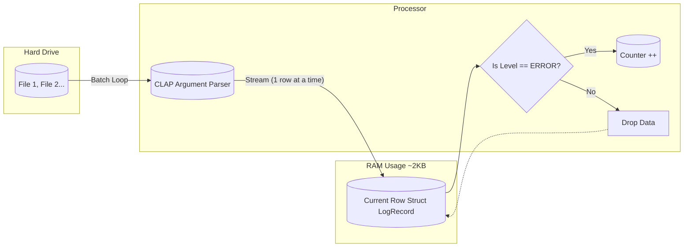

# Rust Log Blaster 🚀

A high-performance, memory-safe **CLI tool** for log processing built in Rust. It demonstrates an ETL (Extract, Transform, Load) pipeline that streams data from massive CSV files with minimal memory overhead.

> **Key Feature:** Now supports **Batch Processing**. You can feed it multiple log files (e.g., daily logs) and it will process them sequentially without crashing, even if one file is corrupt.

## Performance Benchmark (Python VS Rust)

| Language   | Execution Time (500MB File) | Speedup  |
| ---------- | --------------------------- | -------- |
| **Python** | **4.21s**                   | **1x**   |
| **Rust**   | **1.29s**                   | **3.2x** |

## Usage (CLI)

This tool uses `clap` for a robust command-line interface.

**1. Basic Usage:**

```bash
# Process a single specific file
cargo run --release -- --filenames my_log.csv

```

**2. Batch Processing (New!):**

```bash
# Process multiple files in one go
cargo run --release -- server_log_1.csv server_log_2.csv

```

**3. View Help:**

```bash
cargo run --release -- --help

```

## Workflow

Unlike tools that load the entire file into RAM (like Pandas), Log Blaster uses a **Streaming Iterator**. It holds only one row in memory at a time.



## Tech Stack

- **Language:** Rust (Edition 2021)
- **CLI Interface:** `clap` (Command Line Argument Parser) - _Added for robust user input._
- **Core Logic:** `csv` crate for reliable parsing.
- **Data Handling:** `serde` for type-safe deserialization.
- **Safety:** Strict Ownership model ensures automatic memory cleanup.

## Engineering Evolution (Changelog)

- **v1.0 (Script):** Hardcoded filepath, single file processing.
- **v1.1 (CLI Tool):** Integrated `clap` to support dynamic arguments.
- Added **Batch Processing** (Vectorized inputs).
- Implemented **Fault Tolerance** (Process continues even if one file fails).
- Added Struct-based Type Safety.

## Engineering Decisions: Why Single-Threaded?

During optimization, I benchmarked a **Multi-Threaded** approach using `rayon`.

- **Hypothesis:** Parallel processing would improve performance on a multi-core machine.
- **Result:** Performance **degraded** (1.29s -> 1.94s).
- **Root Cause:** The overhead of allocating 10 million Structs into RAM (to enable parallelism) outweighed the CPU gains.
- **Conclusion:** For ETL tasks where data is larger than cache, **Streaming (Iterator)** is superior to **Batch Processing** because it minimizes memory allocation overhead.
