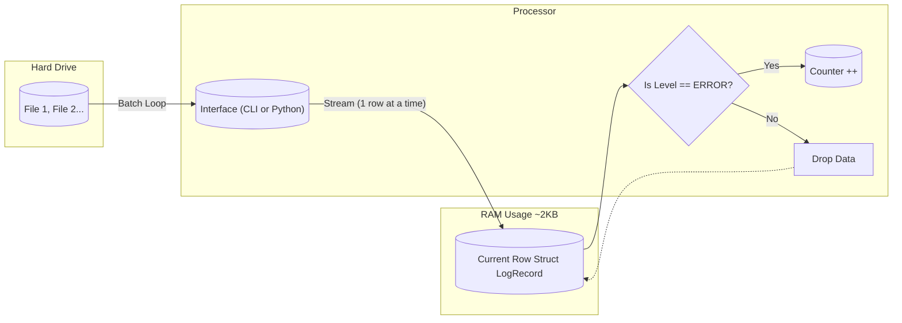

# Rust Log Blaster

A high-performance, memory-safe **Hybrid System** for log processing. It functions as both a standalone **CLI tool** and a **high-speed Python extension**.

It demonstrates an ETL (Extract, Transform, Load) pipeline that streams data from massive CSV files with minimal memory overhead, bridging the gap between Python's ease of use and Rust's raw speed.

## Performance Benchmark (Python VS Rust)

_Benchmark run on a ~500MB dataset._

| Implementation  | Execution Time | Speedup  |
| --------------- | -------------- | -------- |
| **Pure Python** | **11.13s**     | **1x**   |
| **Rust Plugin** | **2.55s**      | **4.4x** |

> **Result:** The Rust implementation is over **400% faster** while maintaining the exact same Python developer experience.

## Usage (Two Modes)

### 1. The Engineer's Mode (CLI)

Written in Rust, using `clap` for robust argument parsing.

```bash
# Process a single specific file
cargo run --release -- large_log.csv

# Batch Process multiple files (Fault Tolerant)
cargo run --release -- server_log_1.csv server_log_2.csv

```

### 2. The Data Scientist's Mode (Python Library)

Exposes the Rust logic as a native Python module using **PyO3**.

```python
import rust_log_blaster

# Looks like Python, runs like C++
# Returns the count of ERROR logs instantly
count = rust_log_blaster.rust_log_count("large_log.csv")
print(f"Errors found: {count}")

```

## Workflow & Architecture

Unlike tools that load the entire file into RAM (like Pandas), Log Blaster uses a **Streaming Iterator**. It holds only one row in memory at a time.



## Tech Stack

- **Core Language:** Rust (Edition 2021)
- **Integration:** `pyo3` (Rust-to-Python bindings) & `maturin` (Build system).
- **CLI Interface:** `clap` (Command Line Argument Parser).
- **Data Handling:** `csv` & `serde` (Zero-copy deserialization).
- **Optimization:** LTO (Link Time Optimization) enabled for release builds.

## Engineering Evolution (Changelog)

- **v1.0 (Script):** Hardcoded filepath, single file processing.
- **v1.1 (CLI Tool):** Integrated `clap` for dynamic arguments and batch processing. Added fault tolerance (skips corrupt files).
- **v2.0 (Hybrid Engine):** Refactored core logic into a shared library (`lib.rs`). Implemented **FFI (Foreign Function Interface)** to allow Python scripts to call Rust directly, achieving a 4.4x speedup.

## Engineering Decisions

### Why Streaming vs. Loading?

For ETL tasks where data is larger than CPU cache, **Streaming (Iterator)** is superior to **Batch Loading**. It minimizes memory allocation overhead (heap churn), keeping the application memory footprint tiny (~2MB) regardless of file size.

### Why Hybrid Python/Rust?

Data Science teams prefer Python for its ecosystem, but Python struggles with massive loops. By offloading the heavy `for` loop to Rust and wrapping it in PyO3, we get "C++ performance" without forcing the Data Science team to learn a new language.

### Installation (Python Module)

To compile the Rust code as a Python library:

```bash
# Requires Maturin
maturin develop --release

```

---
