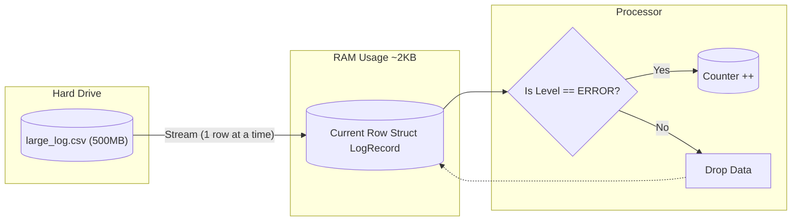

# Rust Log Blaster

A high-performance, memory-safe log processing tool built in Rust. It demonstrates an ETL (Extract, Transform, Load) pipeline that streams data from massive CSV files with minimal memory overhead.

## Performance Benchmark (Python VS Rust)

| Language   | Execution Time (500MB File) | Speedup  |
| :--------- | :-------------------------- | :------- |
| **Python** | **4.21s**                   | **1x**   |
| **Rust**   | **1.29s**                   | **3.2x** |

## Workflow

Unlike tools that load the entire file into RAM (like Pandas), Log Blaster uses a **Streaming Iterator**. It holds only one row in memory at a time, allowing it to process terabyte-scale files on consumer hardware.

## Tech Stack

Language: Rust (Edition 2024)

Core Logic: csv crate for reliable parsing.

Data Handling: serde for type-safe deserialization.

Safety: Strict Ownership model ensures automatic memory cleanup without Garbage Collection.

## Future Improvements

Implement rayon for parallel processing (multi-core support).

Switch to zero-copy deserialization (&str) to further reduce CPU time.

## Engineering Decisions: Why Single-Threaded?

During optimization, I benchmarked a **Multi-Threaded** approach using `rayon`.

- **Hypothesis:** Parallel processing would improve performance on a multi-core machine.
- **Result:** Performance **degraded** (1.29s -> 3.60s).
- **Root Cause:** The overhead of allocating 10 million Structs into RAM (to enable parallelism) outweighed the CPU gains.
- **Conclusion:** For ETL tasks where data is larger than cache, **Streaming (Iterator)** is superior to **Batch Processing** because it minimizes memory allocation overhead.
